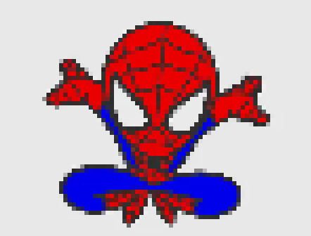

# Image to Pixel Art Converter

A high-quality C program that converts images into pixel art with perfect color preservation and crisp blocky effects.

## Features

- **High Quality**: Preserves original colors with no quality loss
- **Multiple Formats**: JPEG, PNG, TGA, BMP, PSD, GIF, HDR, PIC input/output
- **Customizable Blocks**: Adjustable pixel block sizes
- **Fast Processing**: Direct block sampling algorithm
- **Clean CLI**: Simple command-line interface

## Quick Start

```bash
# Build
make

# Convert image to pixel art
./bin/pixel-art-converter input.jpg output.png

# Custom block size
./bin/pixel-art-converter -s 16 photo.jpg pixel_art.png
```

## Installation

```bash
make install    # Install to /usr/local/bin
make uninstall  # Remove from system
```

## Usage

```
pixel-art-converter [OPTIONS] input_image output_image

Options:
  -s, --size PIXELS     Pixel block size (default: 8)
  -c, --colors COLORS   Max colors for retro mode (default: 64)
  -p, --palette         Use 8-bit retro palette
  -n, --no-quantize     Force preserve all colors
  -i, --info            Show image information
  -h, --help            Show help
```

## Examples

```bash
# Default high-quality conversion
./bin/pixel-art-converter photo.jpg pixel_art.png

# Large blocks for chunky effect
./bin/pixel-art-converter -s 32 image.png chunky.png

# Retro 8-bit style
./bin/pixel-art-converter -p -s 8 modern.jpg retro.png

# Extreme color reduction
./bin/pixel-art-converter -c 8 -s 16 photo.jpg extreme.png
```

## How It Works

The converter uses a direct block sampling algorithm:

1. **Block Division**: Divides image into pixel-sized blocks
2. **Color Sampling**: Samples center pixel color from each block  
3. **Block Filling**: Fills entire block with sampled color
4. **Result**: Perfect pixel art with preserved quality

## Build Requirements

- GCC compiler
- Make
- Standard C libraries

## Project Structure

```
image-pixel/
├── src/           # Source code
├── include/       # Headers and STB libraries  
├── bin/           # Compiled executable
├── examples/      # Test images
└── Makefile       # Build system
```

## Example Images

### Input Images

<table>
  <tr>
    <td>
      
    </td>
    <td>
      
    </td>
  </tr>
  <tr>
    <td>
      
    </td>
    <td>
      
    </td>
  </tr>
</table>

## License

Public domain. Uses STB libraries by Sean Barrett.
# image-to-pixel
